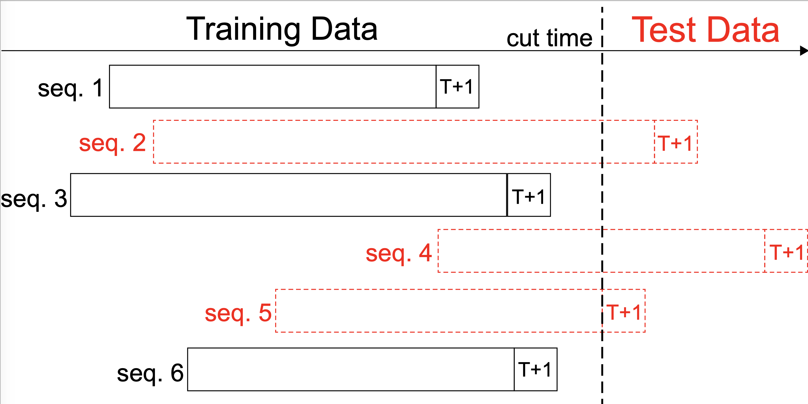

# Hierarchical Periodic Memory Network (HPMN)

A `tensorflow` implementation of all the compared models for our SIGIR 2019 paper: "Lifelong Sequential Modeling with Personalized Memorization for User Response Prediction".

The experiments are supported by Alimama Rank Group from Alibaba Inc.
Paper will be published ASAP.

If you have any problems, please propose an issue or contact the authors: [Kan Ren](http://saying.ren/), [Jiarui Qin](http://apex.sjtu.edu.cn/members/qinjr) and [Yuchen Fang](http://apex.sjtu.edu.cn/members/arthur_fyc).


### Abstract
> User response prediction, which models the user preference w.r.t. the presented items, plays a key role in online services. With two-decade rapid development, nowadays the cumulated user behavior sequences on mature Internet service platforms have become extremely long since the user's first registration. Each user not only has intrinsic tastes, but also keeps changing her personal interests during lifetime. Hence, it is challenging to handle such lifelong sequential modeling for each individual user. Existing methodologies for sequential modeling are only capable of dealing with relatively recent user behaviors, which leaves huge space for modeling long-term especially lifelong sequential patterns to facilitate user modeling. Moreover, one user's behavior may be accounted for various previous behaviors within her whole online activity history, i.e., long-term dependency with multi-scale sequential patterns. In order to tackle these challenges, in this paper, we propose a Hierarchical Periodic Memory Network for lifelong sequential modeling with personalized memorization of sequential patterns for each user. The model also adopts a hierarchical and periodical updating mechanism to capture multi-scale sequential patterns of user interests while supporting the evolving user behavior logs. The experimental results over three large-scale real-world datasets have demonstrated the advantages of our proposed model with significant improvement in user response prediction performance against the state-of-the-arts.

### Dependencies
* [TensorFlow](https://www.tensorflow.org/) 1.4
* [python](https://www.python.org/) 2.7
* numpy
* sklearn

### Data Preparation
- In the `data/amazon` folder, we give three small sample dataset that has been preprocessed, the sample code is running on the sample data. The `dataset_crop.pkl` is for the baseline `SHAN` (cut a short-term and a long-term sequence) and `dataset_hpmn.pkl` (padding in the front) is for our `HPMN` model, all the other baselines are based on the `dataset.pkl`
- For the full dataset, the raw dataset link are [Amazon](http://snap.stanford.edu/data/amazon/productGraph/categoryFiles/reviews_Electronics_5.json.gz), [Taobao](https://tianchi.aliyun.com/dataset/dataDetail?dataId=649) and [XLong](https://tianchi.aliyun.com/dataset/dataDetail?dataId=22482).
- For `Amazon` and `Taobao`, you should extract the files into `data/raw_data/amazon` and `data/raw_data/taobao`, then do the following to preprocess the dataset:
```
python preprocess_amazon.py
python preprocess_taobao.py
```

### Run the Codes
- To run the code of the models:
```
python hpmn.py [DATASET] # To run HPMN, [DATASET] can be amazon or taobao
python train.py [MODEL] [DATASET] [GPU] # To run DNN/SVD++/GRU4Rec/DIEN/Caser/LSTM/, [GPU] is the GPU env 
python shan.py [DATASET] [GPU] # To run SHAN
python rum.py [DATASET] [GPU] # To run RUM
```

### Citation
You are more than welcome to cite our paper:
```
@inproceedings{ren2019lifelong,
	title={Lifelong Sequential Modeling with Personalized Memorization for User Response Prediction},
	author={Ren, Kan and Qin, Jiarui and Fang, Yuchen and Zhang, Weinan and Zheng, Lei and Bian, Weijie and Zhou, Guorui and Xu, Jian and Yu, Yong and Zhu, Xiaoqiang and Gai, Kun},
	booktitle={Proceedings of 42nd International ACM SIGIR Conference on Research and Development in Information Retrieval},
	year={2019},
  organization={ACM}
}
```

### Note: Train/Test Splitting
<div align=center></div>

- As shown in figure, we split the training and testing dataset according to the timestamp of the prediction behavior.
We set a cut time within the time range covered by the full dataset.
If the last behavior of a sequence took place before the cut time, the sequence is put into the training set. Otherwise it would be in the test set. In this way, training set is about 70% of the whole dataset and test set is about 30%.
